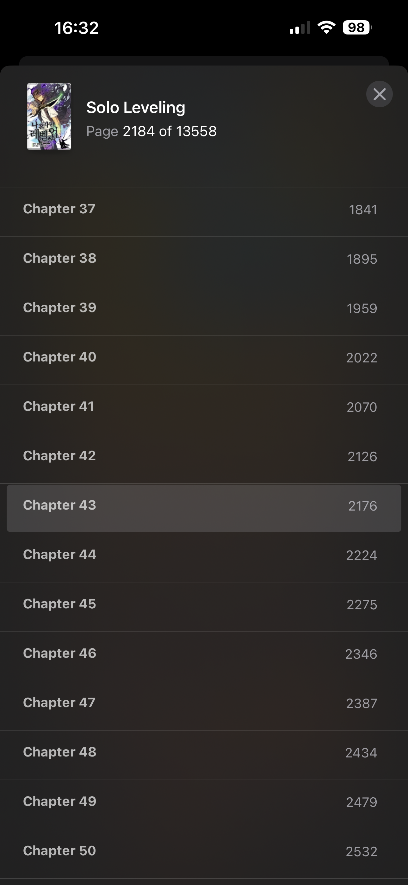

<div align="center">
  
</div>
<br>
<div align="center">
  
  
  
  
  
</div>

---

# 📚 Manga to Books

**Manga to Books** is an **open-source** tool that **downloads manga** from a [Manga Bat](https://h.mangabat.com/) website and **converts** it into the **EPUB** format, making it compatible with **Apple’s Books app** on **iPhone**, **iPad**, and **MacBook**. Built with **Python**, this program offers **the best way** to enjoy **manga** in a digital format.

* Specifically designed for **Apple’s** **Books** **app** compatibility.
* Built with Python for simplicity and **cross-platform** support.
* Downloads **manga** and **automatically converts** it to **EPUB format**.
* Easy-to-use **command-line** interface for quick and efficient manga conversion.

Enjoy your favorite manga in high-quality EPUB format across all your Apple devices!

---

## 🖼️ Preview

<p align="center">
  
  
  
</p>

---

## 🛠️ Installation

To install this project, Launch the Terminal app on your system, and run the commands below. <br>
  - If a pop-up appears prompting you to download the Xcode Command Line Tools after the first command, click “Download” and then run the first command again.

1. **Clone repo**
```bash
git clone https://github.com/marsdevx/manga2books.git ~/manga2books
```

2. **Install dependencies**
```bash
brew install python
pip3 install --break-system-packages pillow
pip3 install --break-system-packages ebooklib
pip3 install --break-system-packages natsort
pip3 install --break-system-packages requests
pip3 install --break-system-packages beautifulsoup4
pip3 install --break-system-packages validators
pip3 install --break-system-packages re
```

3. **Set Up an Alias**

- For Zsh Users
```bash
echo "\nalias manga2books=\"python3 /Users/$(whoami)/manga2books/manga2books.py\"" >> ~/.zshrc
source ~/.zshrc
```

- For Bash Users:
```bash
echo "\nalias manga2books=\"python3 /Users/$(whoami)/manga2books/manga2books.py\"" >> ~/.bashrc
source ~/.bashrc
```

---

## 🚀 Usage

1. **Copy the Manga URL**

- Go to the [Manga Bat](https://h.mangabat.com/) website.
- Find the manga you want to download.
- Copy the URL of the manga page from your browser's address bar.


<br>

2. **Download the Manga**
* Run the following command, replacing the URL with the one you copied:

```bash
manga2books https://readmangabat.com/read-iw386363
```

3. **Download Specific Chapters**
* To download only specific chapters, add the chapter range after the URL:

```bash
manga2books https://readmangabat.com/read-iw386363 30-70
```

---

## 📋 License

All the code contained in this repo is licensed under the [MIT License](LICENSE)

```
MIT License

Copyright (c) 2025 marsdevx

Permission is hereby granted, free of charge, to any person obtaining a copy
of this software and associated documentation files (the "Software"), to deal
in the Software without restriction, including without limitation the rights
to use, copy, modify, merge, publish, distribute, sublicense, and/or sell
copies of the Software, and to permit persons to whom the Software is
furnished to do so, subject to the following conditions:

The above copyright notice and this permission notice shall be included in all
copies or substantial portions of the Software.

THE SOFTWARE IS PROVIDED "AS IS", WITHOUT WARRANTY OF ANY KIND, EXPRESS OR
IMPLIED, INCLUDING BUT NOT LIMITED TO THE WARRANTIES OF MERCHANTABILITY,
FITNESS FOR A PARTICULAR PURPOSE AND NONINFRINGEMENT. IN NO EVENT SHALL THE
AUTHORS OR COPYRIGHT HOLDERS BE LIABLE FOR ANY CLAIM, DAMAGES OR OTHER
LIABILITY, WHETHER IN AN ACTION OF CONTRACT, TORT OR OTHERWISE, ARISING FROM,
OUT OF OR IN CONNECTION WITH THE SOFTWARE OR THE USE OR OTHER DEALINGS IN THE
SOFTWARE.
```